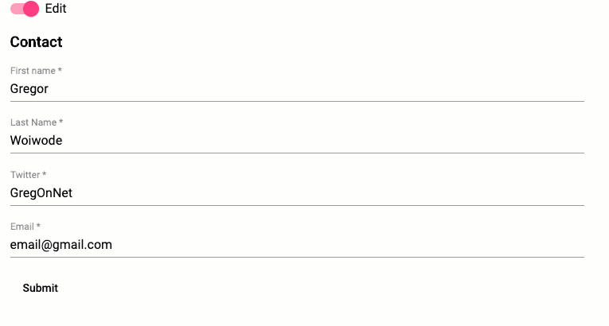

# Toggle edit & view mode with ngx-formly



## Try it out.

```bash
git clone git@github.com:GregOnNet/ngx-formly-playground.git
cd ngx-formly-playground
yarn install
yarn start -- open
```

Build with [Angular](https://angular.io) ❤️.
